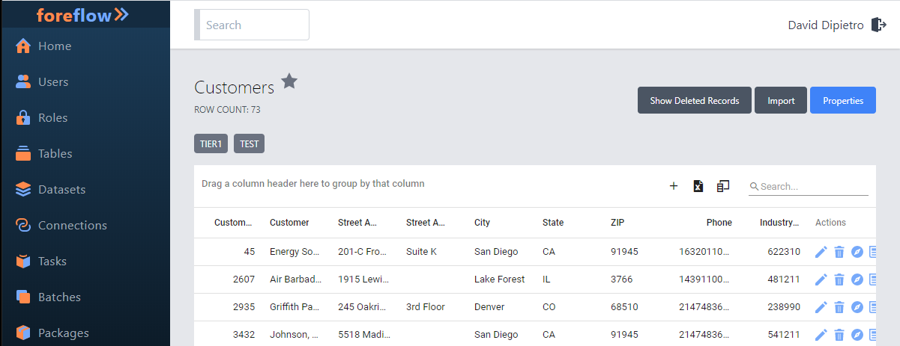
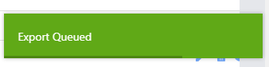
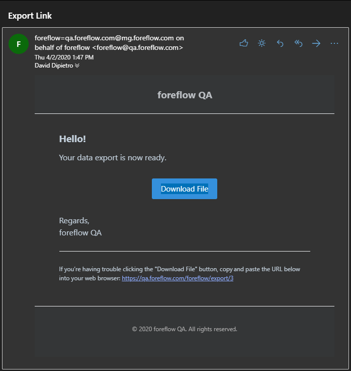

# Table Export Data

## Introduction

One of the features of foreflow is the ability to export data.  This page explains the steps to take in order to make that data export happen. For the purspose of this demonstration we will be using the **Customers** table below.

## Exporting The Data

### Selecting The Export Data Icon

In the body of the table there is an **Export Data** icon.  It is an image of a file with an **X** in the middle of it.

When this icon is clicked an Export Data dialog box appears.  The act of exporting data is a **Task** that needs to be scheduled.  Behind the scenes foreflow adds this task to a **Queue** of **Tasks** for the server to accomplish. 

When the **Queue Export** button is clicked a a fleeting green alert will appear notifying you that the export has been queued. 

Finally, as the server finishes the Export Data task, an email is sent to you with a **Download File** link informing you that your data export is now available.

