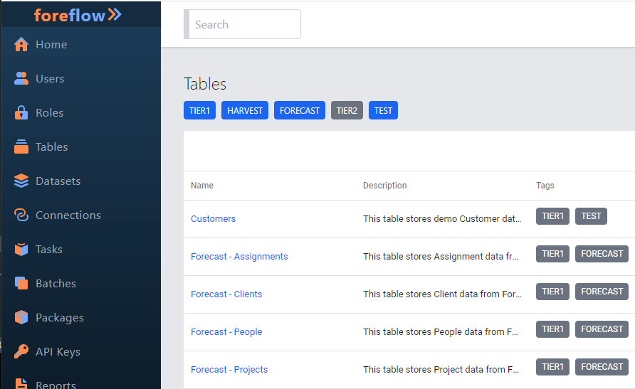
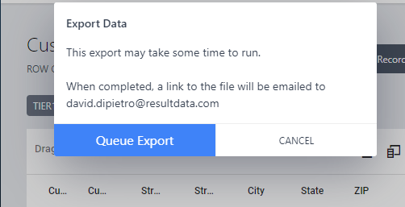

# Table Export Data

## Selecting a Table

One of the features of foreflow is the ability to export data.  This page explains the steps to take in order to make that data export happen.

On the main menu select the **Tables** option.

## Using Table Tags

To the right of the menu the Tables pane will appear.  Immediately below the **Tables** title are found **Tags** that have been applied to the tables that have been created.

When a tag is blue it indicates that tables with this tag will be included in the visible record set.  

### Limiting the Record Set

In order to to remove items from the record set, simply click on the tag and the color changes from blue to gray indicating that it is no longer in the record set.

Notice that the tables with the **TIER2** Tags have been removed from the list and the **TIER2** Tag is now Gray. For the purpose of this demonstration the **TEST** Tag is the only record set criteria that should be selected.

Notice that the **TIER1** still appears beside the Description of the table because the tables have both tags applied to them even though the search criteria selection is only **TEST**.

### Selecting a Table

For the purspose of this demonstration the **Customers** table will be selected by clicking on the **Customers** link under the Name column.  The pane to the right of the menu now displays the **Customers** table along with its various tags and options.

## Exporting The Data

### Selecting The Export Data Icon

In the body of the table there is an **Export Data** icon.  It is an image of a file with an **X** in the middle of it.

When this icon is clicked an Export Data dialog box appears.  The act of exporting is a **Task** that needs to be scheduled.  Behind the scenes foreflow adds this task to a **Queue** of **Tasks** for the server to accomplish.  

When the **Queue Export** button is clicked a response message will appear.

As the server gets to the Export Data task an email will be sent to you with the file attached.

