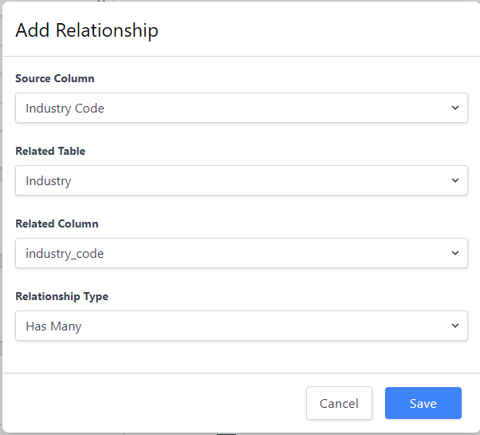

 Table Properties 

After selecting a particular table, you can access its properties by clicking the **Properties** button.  The properties page is divided into several sections due to the many options available.  After you set all the properties that you want to be in effect for this table, be sure to click the **Update Table Properties**.

## Table Properties

Here you will find the general table properties:

### Friendly Name

This is a user-friendly or business-friendly display name for the table.  This name can be edited by a user with appropriate rights.

### Description

This is the explanation of the contents and purpose of this data set.  This description can be edited by a user with appropriate rights.

### Database Table Name
This is the system name of the table which _foreflow_ creates when the table is created.  It cannot be edited.

### Default Number of Rows to Display

This sets the number of rows that will display on each page of the table grid.

### Editing Mode

Here you will find options that _foreflow_ has built-in for a user with appropriate rights to edit the data in your tables.

- #### Cell

    When you select the **Cell** option, the user can click on a cell to update it. _foreflow_ designates which cell is active by underlining it.  

    - To **Accept** the change click the **check mark**.  
    - To **Cancel** the edit click the **X**.
 
- #### Row
 
    When you select the **Row** option, the user must select the edit icon before clicking on a cell to update it.

    - To **Accept** the change click the **check mark**.  
    - To **Cancel** the edit click the **X**.
 
- #### Inline Form
 
    When you select the **Inline Form** option, when the user selects a record for editing, _foreflow_ will replace the line with a form for the user to edit.

    - To **Accept** the change click the **check mark**.  
    - To **Cancel** the edit click the **X**.
 
- #### Pop-up Form
 
    When you select the **Pop-up Form** option, when the user selects a record for editing, _foreflow_ will open a pop-up window form for the user to edit.

    - To **Accept** the change click the **SAVE** button.  
    - To **Cancel** the edit click the **CANCEL** button.
 
### Default Sort

This is where you can select one of the columns on the table as your default sorting column.

- #### Sort Direction

    When you select either **Ascending** or **Descending** _foreflow_ applies this direction to the **Default Sort** column that you have selected.

### Email Import

Here you will be configuring a way to either append or replace data in your table by utilizing an email attachment.  When you click on the **Configure Email Import** button a pop up will appear which contains an interactive file upload box.  When you either drop or select a data file with headers, the following things occur.

- _foreflow_ generates a **table-specific** email address of this pattern **[Universally_Unique_ID]@[your__foreflow__domain].com**.  You will need to use this address to append or replace formatted data in your table

- _foreflow_ attempts to match the headers on that formatted data file to the columns in your table.  _foreflow_ makes an interface available which allows you to adjust those matches that _foreflow_ cannot match on its own.

- _foreflow_ asks you to choose whether you want this formatted file to **Append To** or to **Replace** the data in your table.

When you attach a formatted data file to an email to the _foreflow_ generated address, _foreflow_ will either append or replace the data in your table with the data in your file, depending on the action you configured.

### Use Client-Side Data Viewer

This is where you can choose to display your table in either a server-paged data grid or the Client-Side Data Viewer.  While the Client-Side Data Viewer has greater functionality associated with it, the quantity of the data is significantly limited (10,000 rows) due to the memory constraints of your Client-Side computer and the web browser you are using.  Because of these constraints _foreflow_ defaults this value to **False**.

### Display Column Chooser

Here you can choose whether or not the users of this grid will have the ability to see and choose columns to display for this data table.  If the **Display Column Chooser** is set to **False** then the **Column Chooser** icon will be **unavailable** to the user.  In this case, _foreflow_ will only serve up the columns whose property **IS SHOWN BY DEFAULT** is checked in the **Column Properties** setup below.

### Allow Data Export

Here you can choose whether or not the users of this grid will have the ability to export the data in this table.  If the **Allow Data Export** is set to **False** then the **Export Data** icon will be **unavailable** to the user.

### Enable Word Wrap

This is where you can choose to allow the height of the rows in your table to increase to allow the full value of the record cells to be displayed.  If the **Enable Word Wrap** is set to false, an **ellipsis ...** will display at the end of a cell where the contents are wider than the space available to the column.

### Read Only

Here you can choose whether or not the users of this grid will have the ability to edit or delete records in this table.  If the **Read-Only** value is set to **True** then the **Edit** and **Delete** icons will be **unavailable** to the user.

## Relationships

The **Relationships** section allows you to define relationships between the primary table to which these properties apply and the other tables to which you have access.

When you click on the **Add Relationships** button a window pops up that expands step-by-step as you explain the relationship through the various drop-down lists.

The **Source Column** drop-down allows you to choose from the columns in the primary table to which this **Properties** page belongs.

The **Related Table** allows you to choose from the other tables in your collection of tables.

The **Related Column** drop-down allows you to choose from the columns in the related table you have selected.

The **Relationship Type** allows you to choose how a selected table relates to your primary table by their respective **RELATED** and **Source** columns.  

- Does the selected table with a **Has Many** relationship have multiple records that store the **SOURCE COLUMN** value of your table in its **RELATED COLUMN**? 

- Does your primary table have a **RELATED COLUMN** that is storing a value of a **SOURCE COLUMN** that **Belongs To** the **RELATED TABLE** you selected?.

## Forms

The **Forms** section provides a way for you to inject form options into your table actions.  

- One use case is to generate a form for fields within your table that may have business logic associated with them.  

    - For example, You might like to make available a **Hire Form** only when an employee record has a **Status** such as **Candidate** in the **Employees** table.

- Another use case is to display a form for a table with a **Has Many** relationship to the selected table.  

    - For example, You might like to add or edit one or more records in the related **Emergency Contact** table through the **Manage Emergency Contacts** Form from the **Employees** table.

When you click the **Add Form** button, _foreflow_ opens up a multi-section **Create Form** page.  

- In the first section, **Details**, you can name and describe the form that you are creating.  

- In the second section, **Access**, _foreflow_ provides you a way to add business logic based on the value of a selected column in your table.

- The third section, **Design**, _foreflow_ provides a simple yet powerful design tool with the flexibility for you to specify the targeted information you want to gather.  _foreflow_ also gives you the ability to logically group this targeted information, across multiple tables, by using the **Add Section** button.

    - The **Table** select box lets you select the table you want to fill.  

        - In one use case, you might want to select the current table to fill in columns that you have hidden in your table details.  
        
        - In another use case, you could select a different table you want to have as a collection point for additional data that is related to a specific record in your primary table.

    - The **Section Title** gives you the ability to logically label this section of your form.

    - The **Use Two Column Layout**  toggle provides you with twice the data-gathering capacity in the same amount of form space.

    - The **Edit Existing Records** toggle gives you section level data security

    - The **Allow Multiple Insert** toggle lets you offer the power of the **Has Many** relationship, to your end-users, at their discretion, on a record by record level.

    - The **Fields in  Section** "Drag and Drop" design box, in conjunction with the **Available Columns** list, gives you the ability to select, order and arrange the columns you want to show to the end-users of this form.
## Column Properties

The **Column Properties** section is where _foreflow_ empowers you to design the column-level data definitions for your table.  

### Add Column

When you click the **Add Column** button, _foreflow_ will open a dynamic **Add Column** dialog box with the power to define the data of your new column, based on the **Type** of the column you select.

#### Default Column Definition and Display Options
In the top 4 definitions, _foreflow_ gives you the ability to name and configure the display features of your new column

- #### Name

    This is the identifying label that you want _foreflow_ to use to reference this column in this table.

- #### Friendly Name

    This is the end-user focused label that you want _foreflow_ to display for this column.

- #### Alignment

    This select box allows you to tell _foreflow_ how you want the orientation of the cell data for this column to be displayed.

- #### Sequence

    This select box gives you the power to set the order in which you want _foreflow_ to display this column.

 #### Type-Based Column Definitions  

 The **Type** options that _foreflow_ offers are **Standard**, **Reference** and **Calculated**.  Each of these **Types** has its own set of definition options that _foreflow_ dynamically displays depending on which **Type** you select.

> #### Standard-Type Definition Options
>
> - #### Column Type
>
>   This drop-down allows you to set the type of data that you want _foreflow_ to enforce in this column.
>
> - #### Column is nullable
>
>   This toggle gives you the power to tell _foreflow_ whether or not this column can have, literally, nothing in it.
>
> - #### Column is unique
>
>   This toggle lets you tell _foreflow_ whether or not to allow a value to exist more than once in this column.
>
> #### Reference-Type Definition Options
>
> - #### Table
>
>   This select-box allows you to tell _foreflow_ which table to use to get the data you want it to display in this column.
>
> - #### Column
>
>   This select box lets your tell _foreflow_ which column has the data, from the selected reference table, that you want to use to fill this column.
>
> - #### Column is nullable
>
>   This toggle gives you the power to tell _foreflow_ whether or not this column can have, literally, nothing in it.
>
> #### Calculated-Type Definition Options
>
> - #### Expression
>
>   This Code box lets you use **Standard SQL** to create the calculation statement that you want _foreflow_ to use, to return a value, for display in this column. 

## Tags

