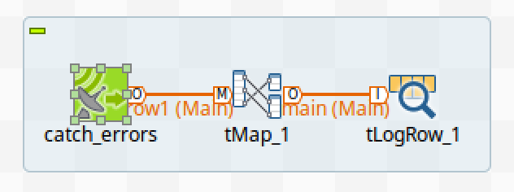
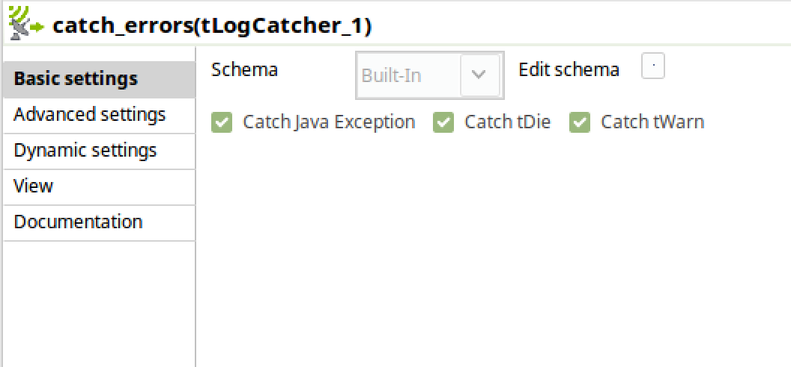
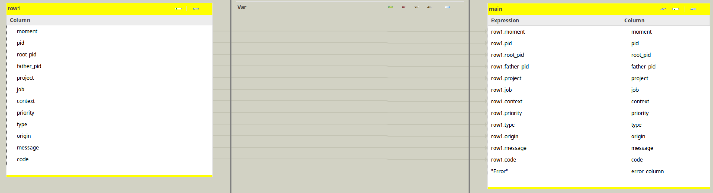
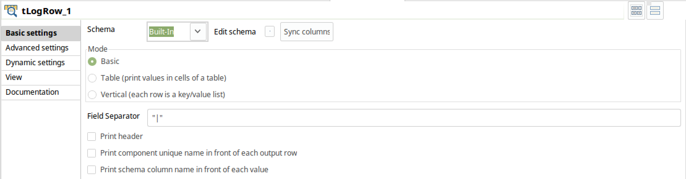

# Talend Tasks

## Error Handling

Foreflow is set up in such a way to be able to receive error output from Talend processes.  In order to have errors from a Talend process bubble up to foreflow, you will need to add a few components to the Talend job. 

You will first need a tLogCatcher component, which needs to be configured to catch Java exceptions, tDie, and tWarn.

The output from the tLogCatcher component needs to be output to a tMap component.

The tMap output needs to be sent to a tLogRow component.

